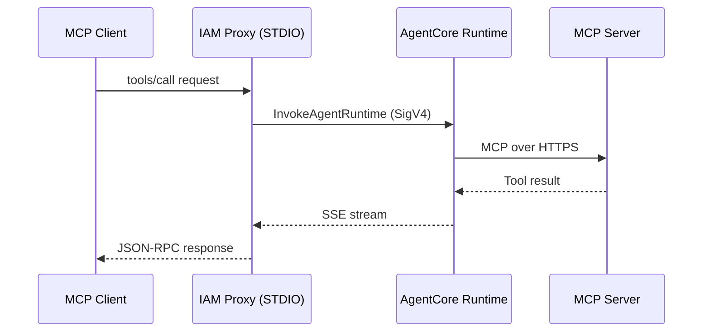
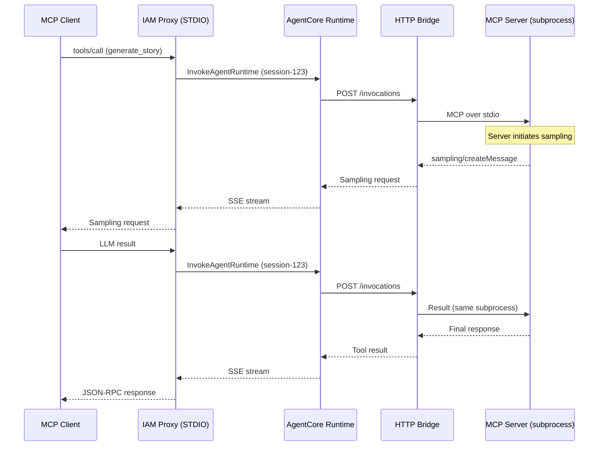

# Amazon Bedrock AgentCore MCP Proxy

## Overview

This repository addresses two limitations in Amazon Bedrock AgentCore when running MCP servers:

1. **IAM Authentication**: AgentCore requires OAuth 2.0 or Cognito for authentication through the gateway.[^gateway-inbound][^cognito-auth] Developer workstations typically use IAM credentials via Identity Center instead. This repository packages a local stdio proxy that signs requests with SigV4, allowing direct invocation of the AgentCore runtime API[^runtime-how] without configuring OIDC providers or VPC access.

2. **Stateful Bidirectional MCP**: AgentCore's native MCP protocol support is stateless. MCP sampling (server-to-client LLM requests) and elicitation (schema-driven data collection) require persistent sessions. This repository provides an HTTP-to-STDIO bridge that maintains a subprocess across invocations, enabling bidirectional MCP flows within AgentCore's serverless infrastructure.

The local proxy handles IAM authentication and presents a standard MCP stdio interface to clients. Two deployment models are provided for the AgentCore runtime:
- **Stateless**: Direct MCP server for simple request/response tools
- **Stateful**: HTTP bridge maintaining a persistent MCP subprocess for sampling and elicitation workflows

## Architecture

### Stateless Model

The stateless model runs an MCP server directly inside the AgentCore runtime. Each `InvokeAgentRuntime` call[^invoke-api] creates a new execution context.



The proxy translates MCP JSON-RPC requests into `InvokeAgentRuntime` API calls. Responses stream back as server-sent events and are forwarded to the client as JSON-RPC messages.

**Appropriate for:**
- Deterministic functions (weather lookup, calculations)
- Stateless API calls
- Simple data transformations

### Stateful Model

The stateful model runs an HTTP-to-STDIO bridge inside the AgentCore runtime. The bridge spawns and maintains a persistent MCP server subprocess. This subprocess persists across multiple `InvokeAgentRuntime` calls with the same `runtimeSessionId`, enabling stateful conversations and bidirectional MCP flows.



The bridge maintains the subprocess for the lifetime of the AgentCore microVM. Session affinity is achieved by passing the same `runtimeSessionId` in subsequent `InvokeAgentRuntime` calls.

**Appropriate for:**
- MCP sampling (server-initiated LLM calls)
- MCP elicitation (structured data collection with Pydantic schemas)
- Multi-turn conversations requiring session state
- Workflows requiring persistent context

## Deployment Model Comparison

| Feature | Stateless | Stateful |
|---------|-----------|----------|
| AgentCore Protocol | MCP | HTTP |
| Session State | No | Yes |
| Sampling Support | No | Yes |
| Elicitation Support | No | Yes |
| Subprocess Lifecycle | Per-request | Per-session |
| Memory Overhead | Lower | Higher |

Choose the deployment model based on whether tools require bidirectional MCP features or session state.

## Repository Layout
- `src/mcp_agentcore_proxy/` MCP STDIO proxy packaged as `mcp-agentcore-proxy`
- `demo/` Demo deployment infrastructure and runtimes
  - `demo/runtime_stateless/` FastMCP application packaged into a container for AgentCore
  - `demo/runtime_stateful/` HTTP↔STDIO bridge container that spawns a stateful MCP server inside the runtime
  - `demo/scripts/` helper scripts including an end-to-end smoketest
  - `demo/template.yaml` and `demo/samconfig.toml` SAM template and config for deploying the demo stack
- `Makefile` build and deployment automation

## Prerequisites
- Python 3.10 or newer plus [uv](https://github.com/astral-sh/uv) for dependency management
- AWS credentials with permission to call `sts:GetCallerIdentity` and `bedrock-agentcore:InvokeAgentRuntime`
- Docker and the AWS SAM CLI if deploying the sample server
- An AgentCore runtime ARN to authenticate against (`AGENTCORE_AGENT_ARN`)

## Installing the Proxy Locally
```bash
uv pip install -e .
```
Set the runtime ARN and region before launching the proxy.
```bash
export AGENTCORE_AGENT_ARN="arn:aws:bedrock:us-east-1:123456789012:agent-runtime/example"
export AWS_REGION="us-east-1"
```

## Running the Proxy with an MCP Client

The proxy can be invoked directly with `uvx` or any orchestrator that speaks MCP STDIO.

**From PyPI (recommended for production use):**
```bash
# Latest version
uvx mcp-agentcore-proxy

# Pinned version
uvx mcp-agentcore-proxy@0.1.0
```

**From GitHub (for latest unreleased changes):**
```bash
uvx --from git+https://github.com/alessandrobologna/agentcore-mcp-proxy mcp-agentcore-proxy
```

**From local clone (for development):**
```bash
uvx --from . mcp-agentcore-proxy
```

The proxy validates IAM credentials with `sts:GetCallerIdentity`, derives an AgentCore `runtimeSessionId`, and relays MCP messages to the remote runtime. Standard output carries the JSON-RPC responses. Errors surface as structured MCP error payloads.

Control how session identifiers are generated with `RUNTIME_SESSION_MODE` (default: `session`):
- `session` creates a random session ID once when the proxy starts (recommended for stateful runtimes).
- `identity` hashes the caller identity returned by `sts:GetCallerIdentity` so multiple proxy invocations under the same IAM principal can reuse a warm runtime.
- `request` generates a new session ID for every MCP request (fully stateless, mainly for testing).

### VS Code MCP Client Example
Configure VS Code MCP to launch the proxy with `uvx` and a pre-set runtime ARN. Replace the ARN value with the runtime you deploy.

**Option 1: Install from PyPI (recommended)**

Install the latest published version:
```json
{
  "servers": {
    "mcp-proxy": {
      "type": "stdio",
      "command": "uvx",
      "args": [
        "mcp-agentcore-proxy"
      ],
      "env": {
        "AGENTCORE_AGENT_ARN": "arn:aws:bedrock-agentcore:us-east-1:123456789012:runtime/example"
      }
    }
  },
  "inputs": []
}
```

To pin to a specific version:
```json
{
  "servers": {
    "mcp-proxy": {
      "type": "stdio",
      "command": "uvx",
      "args": [
        "mcp-agentcore-proxy@0.1.0"
      ],
      "env": {
        "AGENTCORE_AGENT_ARN": "arn:aws:bedrock-agentcore:us-east-1:123456789012:runtime/example"
      }
    }
  },
  "inputs": []
}
```

**Option 2: Install from GitHub (development/latest)**

For the latest unreleased changes:
```json
{
  "servers": {
    "mcp-proxy": {
      "type": "stdio",
      "command": "uvx",
      "args": [
        "--from",
        "git+https://github.com/alessandrobologna/agentcore-mcp-proxy",
        "mcp-agentcore-proxy"
      ],
      "env": {
        "AGENTCORE_AGENT_ARN": "arn:aws:bedrock-agentcore:us-east-1:123456789012:runtime/example"
      }
    }
  },
  "inputs": []
}
```

## Cross-Account Use (Assume Role)
The proxy can assume an IAM role before invoking AgentCore to support cross-account access or tighter scoping.

- Set `AGENTCORE_ASSUME_ROLE_ARN` to the role ARN to assume. When unset, current credentials are used.
- Optionally set `AGENTCORE_ASSUME_ROLE_SESSION_NAME` to customize the STS session name. Defaults to `"mcpAgentCoreProxy"`.

Example:
```bash
export AGENTCORE_ASSUME_ROLE_ARN="arn:aws:iam::111122223333:role/AgentCoreProxyInvokeRole"
uv run scripts/proxy_smoketest.py "$AGENTCORE_AGENT_ARN"
```

When deploying the sample stack, a test role is provisioned:
- Output `ProxyInvokeRoleArn` exposes the assumable role ARN.
- The role trusts the deploying account's root principal and allows `bedrock-agentcore:InvokeAgentRuntime` on the deployed runtime.
In real world scenarios, the role would use conditions and ABAC 
to allow access from other accounts and principals.

Using the generated role:
```bash
make deploy
export AGENTCORE_ASSUME_ROLE_ARN="$(make -s outputs | jq -r '.[] | select(.OutputKey=="ProxyInvokeRoleArn") | .OutputValue')"
uv run demo/scripts/proxy_smoketest.py "$AGENTCORE_AGENT_ARN"
```
This command requires the `jq` CLI to filter the CloudFormation outputs.

## Smoke Test
`demo/scripts/proxy_smoketest.py` exercises the proxy end to end by listing tools, calling `whoami` to reveal the sandbox identifier, fetching `get_weather`, and walking through the story + elicitation flows.
```bash
uv run demo/scripts/proxy_smoketest.py "$AGENTCORE_AGENT_ARN"
```
The script spawns `mcp-agentcore-proxy` via STDIO, initializes an MCP session, and prints any tool output. Example output is illustrative. Actual costs depend on traffic patterns and configuration.

## Bidirectional MCP Examples

The stateful runtime demonstrates bidirectional MCP through sampling and elicitation.

### Sampling

The `generate_story_with_sampling` tool requests LLM inference from the client:

```python
@mcp.tool()
async def generate_story_with_sampling(topic: str, context: Context) -> dict:
    result = await context.session.create_message(
        messages=[
            types.SamplingMessage(
                role="user",
                content=types.TextContent(
                    type="text",
                    text=f"Write a short story about {topic}."
                )
            )
        ],
        max_tokens=300,
    )
    return {"story": result.content.text}
```

The MCP protocol routes the sampling request back to the client. The client runs inference and returns the result to the server.

### Elicitation

The `create_character_profile` tool demonstrates schema-driven data collection:

```python
class CharacterProfileSchema(BaseModel):
    traits: str
    motivation: str

@mcp.tool()
async def create_character_profile(character: str, context: Context) -> dict:
    result = await context.elicit(
        f"Describe {character} in two bullet points",
        CharacterProfileSchema
    )
    return {"profile": result.data.model_dump()}
```

The client validates responses against the Pydantic schema before returning data to the server.

Both tools are included in the stateful runtime container for testing these flows.

## Deploying the Sample FastMCP Server
The `demo/runtime_stateless/` directory contains a FastAPI-based MCP server with completion-style flows (`whoami`, `get_weather`, `request_story`/`submit_story`, and `request_character_profile`/`submit_character_profile`). Deploying the container makes the runtime available through AgentCore.

The `demo/runtime_stateful/` directory demonstrates the new HTTP↔STDIO bridge. It runs the bridge entry point (`mcp-agentcore-server`) and spawns a local MCP process inside the container so the sandbox can hold conversational state across multiple `InvokeAgentRuntime` calls.

### Stateful Bridge Runtime

The stateful runtime is intended for experimenting with bidirectional sampling and multi-step conversations.

The bridge package (`mcp-agentcore-server`) can be installed in any container via pip:

```dockerfile
RUN pip install git+https://github.com/alessandrobologna/agentcore-mcp-proxy
ENV MCP_SERVER_CMD="python -u your_mcp_server.py"
CMD ["mcp-agentcore-server"]
```

The demo container in `demo/runtime_stateful/` builds from the repository root to include the development version:

```bash
docker build -f demo/runtime_stateful/Dockerfile -t agentcore-stateful .
```

The bridge expects `MCP_SERVER_CMD` to point to an executable that speaks MCP over stdio. The `-u` flag forces unbuffered output to prevent communication hangs.

Enable session affinity in the local proxy with `RUNTIME_SESSION_MODE=session`. The bridge keeps a single child process alive for the lifetime of the runtime microVM.

After deployment, the CloudFormation stack emits both `StatelessAgentRuntimeArn` and `StatefulAgentRuntimeArn` outputs. To verify the bridge, run `uv run demo/scripts/proxy_smoketest.py "$STATEFUL_ARN" --mode stateful`.

The demo tools include `whoami`, `get_weather`, `generate_story_with_sampling`, and `create_character_profile` (uses elicitation) for exploring sampling and follow-up prompts within a persistent session.

#### Bridge Environment Variables

The HTTP-to-STDIO bridge (`mcp-agentcore-server`) supports these environment variables:

- `MCP_SERVER_CMD` (required): Command to launch the child MCP server. Must speak MCP JSON-RPC over stdio.
  - Example: `python -u mcp_server.py`
  - The `-u` flag forces unbuffered output, critical to prevent the bridge from hanging while waiting for subprocess responses.

- `MCP_SERVER_CWD` (optional): Working directory for the child process. Defaults to current directory.

- `SERVER_HOST` (optional): Bridge HTTP listen address. Defaults to `0.0.0.0`.

- `SERVER_PORT` (optional): Bridge HTTP listen port. Defaults to `8080`.

- `LOG_LEVEL` (optional): Logging verbosity for both bridge and child. Options: DEBUG, INFO, WARNING, ERROR, CRITICAL. Defaults to INFO.

The bridge automatically sets `PYTHONUNBUFFERED=1` and `PYTHONIOENCODING=UTF-8` in the child process environment to ensure immediate output flushing.
```bash
make build
make push
make deploy
```
The Makefile now builds two images (stateless FastMCP demo and stateful HTTP bridge), pushes both to ECR, and deploys them via SAM. Stack outputs include ARNs for each runtime. Run `make smoke-test` to exercise both runtimes sequentially.

### Makefile Targets
- `make build` builds both runtime images (stateless and stateful) locally using Docker Buildx (default platform `linux/arm64`).
- `make push` ensures the ECR repository exists, logs in, and pushes both images with versioned and digest tags.
- `make deploy` builds, pushes, and deploys the SAM stack in one step using `sam deploy`. Region derives from `AWS_REGION` or your AWS CLI configuration.
- `make outputs` prints CloudFormation stack outputs, including both runtime ARNs once deployed.
- `make smoke-test` runs both smoketest scenarios (stateless followed by stateful).
- `make smoke-test-stateless` and `make smoke-test-stateful` run the individual scenarios if you only need one.
- `make clean` removes local Docker images created by the build step.

Environment prerequisites:
- Set `AWS_REGION` or configure a default region. The Makefile stops if no region is available.
- Ensure Docker and the AWS CLI are installed, along with SAM CLI (`sam`).
- Authenticate with AWS so `aws sts get-caller-identity` succeeds.

These commands incur AWS usage. Example output is illustrative. Actual costs depend on traffic patterns and configuration.

## Development Notes
- Update `pyproject.toml` or `demo/runtime_stateless/requirements.txt` when adding dependencies, then run `uv lock`
- Keep CLI output flushed to STDOUT to avoid blocking MCP clients
- Add logic-heavy tests under `tests/` or `demo/runtime_stateless/tests/` and run them with `uv run pytest`
- Use `uvx --from . mcp-agentcore-proxy` during local iteration for fast reloads
- `src/mcp_agentcore_proxy/version.py` is auto-generated during builds via Hatchling; it should remain untracked

### Running Tests and QA Checks
Install dev dependencies:
```bash
uv pip install -e ".[dev,server]"
```

If you're using a fresh virtual environment:
```bash
uv venv
source .venv/bin/activate  # or .\.venv\Scripts\activate on Windows
uv pip install -e ".[dev,server]"
```

Run unit tests:
```bash
make test
# or run pytest directly
uv run pytest tests/ -v
```

Run linting and formatting checks:
```bash
uvx ruff check .
uvx ruff format --check
```

Apply automatic formatting:
```bash
uvx ruff format
```

Convenience make targets:
- `make lint` — Ruff linting
- `make format` — Apply Ruff formatting
- `make quality` — Lint + formatting check

## Continuous Integration & Publishing

- GitHub Actions workflow `.github/workflows/ci.yml` runs Ruff and pytest for every pull request targeting `main`.
- On pushes to `main`, the same workflow builds distributions, publishes the package to PyPI, and tags the commit as `v<project.version>` from `pyproject.toml` (skipped if `PYPI_API_TOKEN` is not configured).
- Add a repository secret named `PYPI_API_TOKEN` containing a scoped PyPI API token with project publish permissions.
- Release checklist: bump `project.version` in `pyproject.toml`, update changelog/notes if needed, merge to `main`, and verify the workflow finishes successfully.

### Client-Side Handshake Replay (Resilience)

When a stateful container is redeployed (or the child MCP subprocess restarts), the very first message the bridge sees may be a `tools/call` without a preceding MCP `initialize` handshake. Per MCP, the server rejects such requests with `-32602 Invalid request parameters` and logs "Received request before initialization was complete".

To make this transparent to editors, the local CLI proxy now detects this scenario and automatically replays the handshake:
- Caches the last `initialize` payload from the client
- On a `-32602` error for a non-`initialize` request, re-sends `initialize` and a `notifications/initialized` notification
- Retries the original request

This keeps sessions working across infrequent container restarts without switching to fully stateless mode.

Operational notes:
- The proxy emits an MCP log notification (`notifications/message`) describing the replay, so IDEs can surface a human-friendly message.
- STDERR debug lines are also produced when `LOG_LEVEL=DEBUG` or `MCP_PROXY_DEBUG=1` is set. These do not affect STDOUT JSON-RPC.
- If you prefer to avoid this behavior, restart the MCP connection in your client after redeploys so it naturally performs a fresh handshake before any tool calls.

## Troubleshooting
- `Set AGENTCORE_AGENT_ARN (or AGENT_ARN)` indicates the environment variable is missing
- `Unable to call sts:GetCallerIdentity` points to missing IAM credentials or wrong region
- `InvokeAgentRuntime error` payloads mirror the AWS API response; inspect the JSON for permission or runtime issues
- Empty responses usually mean the remote AgentCore runtime closed the stream without data; confirm the deployed server accepts MCP requests
 - `-32602 Invalid request parameters` on `tools/call` after a redeploy means the child server has not been initialized yet. The CLI proxy will auto-replay `initialize` and `notifications/initialized` once and retry; otherwise, restart your MCP session.
 - Assume role errors: verify `AGENTCORE_ASSUME_ROLE_ARN` is correct, your caller has `sts:AssumeRole`, the role trust policy includes your account, and the role allows `bedrock-agentcore:InvokeAgentRuntime` on the target runtime.

## Security Considerations
The proxy relies on the default AWS credential chain. Use dedicated IAM principals with the minimum scope required by Bedrock AgentCore. 

## License
This repository is licensed under the MIT License. See `LICENSE` for details.

## References
[^gateway-inbound]: Configure inbound authentication for Amazon Bedrock AgentCore Gateway. https://docs.aws.amazon.com/bedrock-agentcore/latest/devguide/gateway-inbound-auth.html
[^cognito-auth]: Set up Amazon Cognito as an identity provider for AgentCore Gateway. https://docs.aws.amazon.com/bedrock-agentcore/latest/devguide/identity-idp-cognito.html
[^runtime-how]: Overview of AgentCore runtime flow and IAM SigV4 support. https://docs.aws.amazon.com/bedrock-agentcore/latest/devguide/runtime-how-it-works.html
[^invoke-api]: API reference for InvokeAgentRuntime. https://docs.aws.amazon.com/bedrock-agentcore/latest/APIReference/API_InvokeAgentRuntime.html
