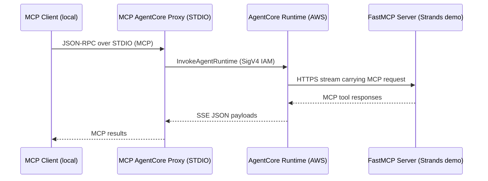

# Amazon Bedrock AgentCore MCP Proxy

## Rationale
Amazon Bedrock AgentCore currently requires the AgentCore gateway when hosting an MCP server.[^gateway-inbound] The gateway expects OAuth 2.0 JWT Bearer Token Authentication with an OIDC provider, or Amazon Cognito for user access.[^cognito-auth] Many developer workstations rely on IAM authentication instead, using role granted with IAM Identity Center. This repository packages a local MCP stdio proxy that signs requests with SigV4 using the default authentication provider chain and talks directly to the AgentCore runtime.[^runtime-how] Your local MCP client still interacts with a standard stdio MCP interface while authentication happens through IAM.

This approach is especially valuable when private network access to a VPC is unavailable or when configuring an OIDC authentication flow is impractical, and also if wanting to establish machine to machine MCP tool use. By leveraging SigV4 IAM authentication, the proxy transparently provides machine credentials and session-based identity, allowing secure and auditable M2M connections without requiring OAuth client credential (2LO) setup or JWT bearer tokens.

## Architecture

The proxy keeps the MCP session alive locally and translates each request into `InvokeAgentRuntime` calls.[^invoke-api] Responses stream back as JSON-RPC messages. The sample FastMCP server demonstrates a simple Strands-based agent that uses the Bedrock `amazon.nova-micro-v1:0` model and exposes three tools: `get_weather`, `tell_joke`, and `whoami` (returns the sandbox identifier for the running instance).

## Repository Layout
- `src/mcp_agentcore_proxy/` MCP STDIO proxy packaged as `mcp-agentcore-proxy`
- `server/` FastMCP application packaged into a container for AgentCore
- `scripts/` helper scripts including an end-to-end smoketest
- `Makefile`, `template.yaml`, and `samconfig.toml` for building and deploying the demo stack

## Prerequisites
- Python 3.10 or newer plus [uv](https://github.com/astral-sh/uv) for dependency management
- AWS credentials with permission to call `sts:GetCallerIdentity` and `bedrock-agentcore:InvokeAgentRuntime`
- Docker and the AWS SAM CLI if deploying the sample server
- An AgentCore runtime ARN to authenticate against (`AGENTCORE_AGENT_ARN`)

## Installing the Proxy Locally
```bash
uv pip install -e .
```
Set the runtime ARN and region before launching the proxy.
```bash
export AGENTCORE_AGENT_ARN="arn:aws:bedrock:us-east-1:123456789012:agent-runtime/example"
export AWS_REGION="us-east-1"
```

## Running the Proxy with an MCP Client
Invoke the CLI directly with uvx or any orchestrator that speaks MCP STDIO.
```bash
uvx --from . mcp-agentcore-proxy
```
When launching directly from Git without cloning, target the repository root.
```bash
uvx --from git+https://github.com/alessandrobologna/agentcore-mcp-proxy mcp-agentcore-proxy
```
The proxy validates IAM credentials with `sts:GetCallerIdentity`, derives an AgentCore `runtimeSessionId`, and relays MCP messages to the remote runtime. Standard output carries the JSON-RPC responses. Errors surface as structured MCP error payloads.

Control how session identifiers are generated with `RUNTIME_SESSION_MODE`:
- `identity` (default) hashes the caller identity returned by `sts:GetCallerIdentity`.
- `session` creates a random session ID once when the proxy starts.
- `request` generates a new session ID for every MCP request.

### VS Code MCP Client Example
Configure VS Code MCP to launch the proxy with `uvx` and a pre-set runtime ARN. Replace the ARN value with the runtime you deploy.
```json
{
  "servers": {
    "mcp-proxy": {
      "type": "stdio",
      "command": "uvx",
      "args": [
        "--from",
        "git+https://github.com/alessandrobologna/agentcore-mcp-proxy",
        "mcp-agentcore-proxy"
      ],
      "env": {
        "AGENTCORE_AGENT_ARN": "arn:aws:bedrock-agentcore:us-east-1:123456789012:runtime/example"
      }
    }
  },
  "inputs": []
}
```

## Cross-Account Use (Assume Role)
The proxy can assume an IAM role before invoking AgentCore to support cross-account access or tighter scoping.

- Set `AGENTCORE_ASSUME_ROLE_ARN` to the role ARN to assume. When unset, current credentials are used.
- Optionally set `AGENTCORE_ASSUME_ROLE_SESSION_NAME` to customize the STS session name. Defaults to `"mcpAgentCoreProxy"`.

Example:
```bash
export AGENTCORE_ASSUME_ROLE_ARN="arn:aws:iam::111122223333:role/AgentCoreProxyInvokeRole"
uv run scripts/proxy_smoketest.py "$AGENTCORE_AGENT_ARN"
```

When deploying the sample stack, a test role is provisioned:
- Output `ProxyInvokeRoleArn` exposes the assumable role ARN.
- The role trusts the deploying account's root principal and allows `bedrock-agentcore:InvokeAgentRuntime` on the deployed runtime.

Using the generated role:
```bash
make deploy
export AGENTCORE_ASSUME_ROLE_ARN="$(make -s outputs | jq -r '.[] | select(.OutputKey=="ProxyInvokeRoleArn") | .OutputValue')"
uv run scripts/proxy_smoketest.py "$AGENTCORE_AGENT_ARN"
```
This command requires the `jq` CLI to filter the CloudFormation outputs.

## Smoke Test
`scripts/proxy_smoketest.py` exercises the proxy end to end by listing tools, calling `whoami` to reveal the sandbox identifier, fetching `get_weather` for New York, and asking `tell_joke` about programmers.
```bash
uv run scripts/proxy_smoketest.py "$AGENTCORE_AGENT_ARN"
```
The script spawns `mcp-agentcore-proxy` via STDIO, initializes an MCP session, and prints any tool output. Example output is illustrative. Actual costs depend on traffic patterns and configuration.

## Deploying the Sample FastMCP Server
The `server/` directory contains a FastAPI-based MCP server that uses Strands and Bedrock. Deploying the container makes the runtime available through AgentCore.
```bash
make build
make push
make deploy
```
The Makefile handles Docker builds, ECR pushes, and SAM deployment. Stack outputs include the AgentCore runtime ARN. Run `make smoke-test` to resolve the ARN automatically and execute the smoketest against the deployed stack.

### Makefile Targets
- `make build` builds the container image locally using Docker Buildx (default platform `linux/arm64`).
- `make push` ensures the ECR repository exists, logs in, and pushes the tagged image along with a digest tag.
- `make deploy` builds, pushes, and deploys the SAM stack in one step using `sam deploy`. Region derives from `AWS_REGION` or your AWS CLI configuration.
- `make outputs` prints CloudFormation stack outputs, including the AgentCore runtime ARN once deployed.
- `make smoke-test` resolves the runtime ARN from stack outputs and runs the smoketest via `uv run` using the local CLI module.
- `make clean` removes local Docker images created by the build step.

Environment prerequisites:
- Set `AWS_REGION` or configure a default region. The Makefile stops if no region is available.
- Ensure Docker and the AWS CLI are installed, along with SAM CLI (`sam`).
- Authenticate with AWS so `aws sts get-caller-identity` succeeds.

These commands incur AWS usage. Example output is illustrative. Actual costs depend on traffic patterns and configuration.

## Development Notes
- Update `pyproject.toml` or `server/requirements.txt` when adding dependencies, then run `uv lock`
- Keep CLI output flushed to STDOUT to avoid blocking MCP clients
- Add logic-heavy tests under `tests/` or `server/tests/` and run them with `uv run pytest`
- Use `uvx --from . mcp-agentcore-proxy` during local iteration for fast reloads

## Troubleshooting
- `Set AGENTCORE_AGENT_ARN (or AGENT_ARN)` indicates the environment variable is missing
- `Unable to call sts:GetCallerIdentity` points to missing IAM credentials or wrong region
- `InvokeAgentRuntime error` payloads mirror the AWS API response; inspect the JSON for permission or runtime issues
- Empty responses usually mean the remote AgentCore runtime closed the stream without data; confirm the deployed server accepts MCP requests
 - Assume role errors: verify `AGENTCORE_ASSUME_ROLE_ARN` is correct, your caller has `sts:AssumeRole`, the role trust policy includes your account, and the role allows `bedrock-agentcore:InvokeAgentRuntime` on the target runtime.

## Security Considerations
The proxy relies on the default AWS credential chain. Use dedicated IAM principals with the minimum scope required by Bedrock AgentCore. 

## License
This repository is licensed under the MIT License. See `LICENSE` for details.

## References
[^gateway-inbound]: Configure inbound authentication for Amazon Bedrock AgentCore Gateway. https://docs.aws.amazon.com/bedrock-agentcore/latest/devguide/gateway-inbound-auth.html
[^cognito-auth]: Set up Amazon Cognito as an identity provider for AgentCore Gateway. https://docs.aws.amazon.com/bedrock-agentcore/latest/devguide/identity-idp-cognito.html
[^runtime-how]: Overview of AgentCore runtime flow and IAM SigV4 support. https://docs.aws.amazon.com/bedrock-agentcore/latest/devguide/runtime-how-it-works.html
[^invoke-api]: API reference for InvokeAgentRuntime. https://docs.aws.amazon.com/bedrock-agentcore/latest/APIReference/API_InvokeAgentRuntime.html
