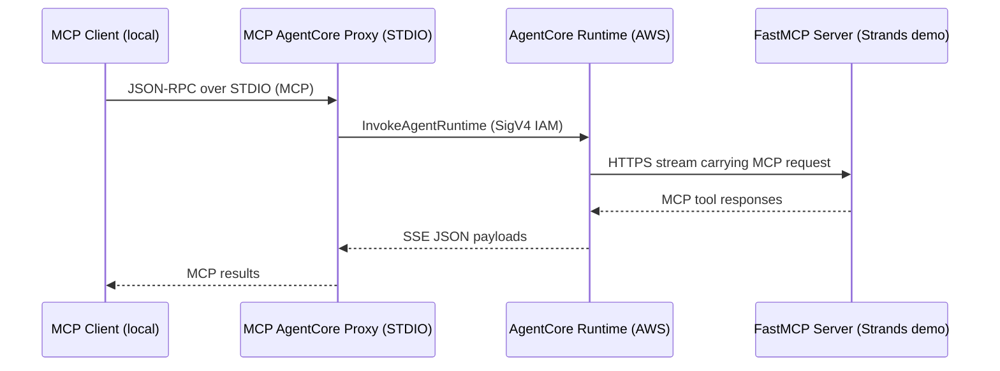

# Amazon Bedrock AgentCore MCP Proxy

## Rationale
Amazon Bedrock AgentCore currently requires the AgentCore gateway when hosting an MCP server.[^gateway-inbound] The gateway expects OIDC or Amazon Cognito for user access.[^cognito-auth] Many developer sandboxes rely on IAM credentials instead. This repository packages a local MCP STDIO proxy that signs requests with SigV4 and talks directly to the AgentCore runtime.[^runtime-how] Your local MCP client still interacts with a standard MCP interface while authentication happens through IAM.

## Architecture

The proxy keeps the MCP session alive locally and translates each request into `InvokeAgentRuntime` calls.[^invoke-api] Responses stream back as JSON-RPC messages. The sample FastMCP server demonstrates a simple Strands-based agent that uses the Bedrock `amazon.nova-micro-v1:0` model.

## Repository Layout
- `src/mcp_agentcore_proxy/` MCP STDIO proxy packaged as `mcp-agentcore-proxy`
- `server/` FastMCP application packaged into a container for AgentCore
- `scripts/` helper scripts including an end-to-end smoketest
- `Makefile`, `template.yaml`, and `samconfig.toml` for building and deploying the demo stack

## Prerequisites
- Python 3.10 or newer plus [uv](https://github.com/astral-sh/uv) for dependency management
- AWS credentials with permission to call `sts:GetCallerIdentity` and `bedrock-agentcore:InvokeAgentRuntime`
- Docker and the AWS SAM CLI if deploying the sample server
- An AgentCore runtime ARN to authenticate against (`AGENTCORE_AGENT_ARN`)

## Installing the Proxy Locally
```bash
uv pip install -e .
```
Set the runtime ARN and region before launching the proxy.
```bash
export AGENTCORE_AGENT_ARN="arn:aws:bedrock:us-east-1:123456789012:agent-runtime/example"
export AWS_REGION="us-east-1"
```

## Running the Proxy with an MCP Client
Invoke the CLI directly with uvx or any orchestrator that speaks MCP STDIO.
```bash
uvx --from . mcp-agentcore-proxy
```
When launching directly from Git without cloning, target the repository root.
```bash
uvx --from git+https://github.com/alessandrobologna/agentcore-mcp-proxy mcp-agentcore-proxy
```
The proxy validates IAM credentials with `sts:GetCallerIdentity`, derives a deterministic AgentCore `runtimeSessionId`, and relays MCP messages to the remote runtime. Standard output carries the JSON-RPC responses. Errors surface as structured MCP error payloads.

## Smoke Test
`scripts/proxy_smoketest.py` exercises the proxy end to end by listing tools and optionally calling `get_weather`.
```bash
uv run scripts/proxy_smoketest.py "$AGENTCORE_AGENT_ARN" --city "Seattle"
```
The script spawns `mcp-agentcore-proxy` via STDIO, initializes an MCP session, and prints any tool output. Example output is illustrative. Actual costs depend on traffic patterns and configuration.

## Deploying the Sample FastMCP Server
The `server/` directory contains a FastAPI-based MCP server that uses Strands and Bedrock. Deploying the container makes the runtime available through AgentCore.
```bash
make build
make push
make deploy
```
The Makefile handles Docker builds, ECR pushes, and SAM deployment. Stack outputs include the AgentCore runtime ARN. Run `make smoke-test` to resolve the ARN automatically and execute the smoketest against the deployed stack.

## Development Notes
- Update `pyproject.toml` or `server/requirements.txt` when adding dependencies, then run `uv lock`
- Keep CLI output flushed to STDOUT to avoid blocking MCP clients
- Add logic-heavy tests under `tests/` or `server/tests/` and run them with `uv run pytest`
- Use `uvx --from . mcp-agentcore-proxy` during local iteration for fast reloads

## Troubleshooting
- `Set AGENTCORE_AGENT_ARN (or AGENT_ARN)` indicates the environment variable is missing
- `Unable to call sts:GetCallerIdentity` points to missing IAM credentials or wrong region
- `InvokeAgentRuntime error` payloads mirror the AWS API response; inspect the JSON for permission or runtime issues
- Empty responses usually mean the remote AgentCore runtime closed the stream without data; confirm the deployed server accepts MCP requests

## Security Considerations
The proxy never writes credentials to disk and relies on the default AWS credential chain. Use dedicated IAM principals with the minimum scope required by Bedrock AgentCore. Rotate credentials frequently and audit CloudTrail events for unexpected runtime invocations.

## License
This repository is licensed under the MIT License. See `LICENSE` for details.

## References
[^gateway-inbound]: Configure inbound authentication for Amazon Bedrock AgentCore Gateway. https://docs.aws.amazon.com/bedrock-agentcore/latest/devguide/gateway-inbound-auth.html
[^cognito-auth]: Set up Amazon Cognito as an identity provider for AgentCore Gateway. https://docs.aws.amazon.com/bedrock-agentcore/latest/devguide/identity-idp-cognito.html
[^runtime-how]: Overview of AgentCore runtime flow and IAM SigV4 support. https://docs.aws.amazon.com/bedrock-agentcore/latest/devguide/runtime-how-it-works.html
[^invoke-api]: API reference for InvokeAgentRuntime. https://docs.aws.amazon.com/bedrock-agentcore/latest/APIReference/API_InvokeAgentRuntime.html
